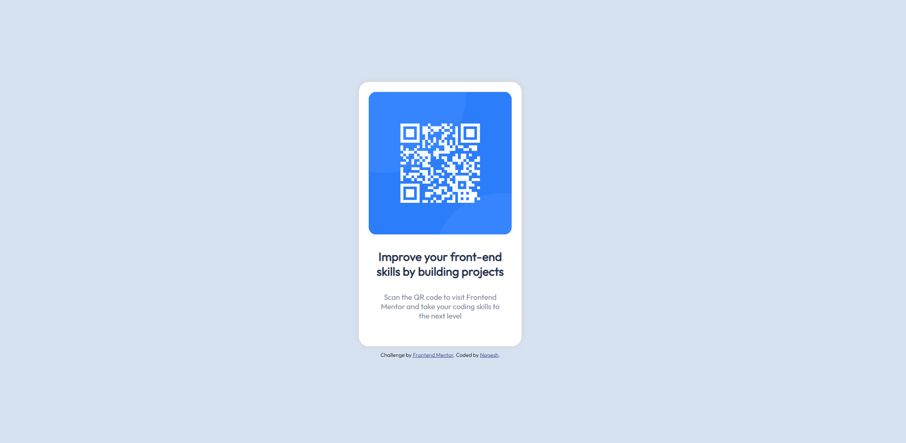

# Frontend Mentor - QR code component solution

This is a solution to the [QR code component challenge on Frontend Mentor](https://www.frontendmentor.io/challenges/qr-code-component-iux_sIO_H). Frontend Mentor challenges help you improve your coding skills by building realistic projects. 

## Table of contents

- [Overview](#overview)
  - [Screenshot](#screenshot)
  - [Links](#links)
- [My process](#my-process)
  - [Built with](#built-with)
  - [What I learned](#what-i-learned)
  - [Useful resources](#useful-resources)
- [Author](#author)

**Note: Delete this note and update the table of contents based on what sections you keep.**

## Overview

### Screenshot



### Links

- Solution URL: https://github.com/nageshpk/QR-Code
- Live Site URL: https://nageshpk.github.io/QR-Code/

## My process

### Built with

- Semantic HTML5 markup
- CSS custom properties
- Flexbox

### What I learned

one main thing learnt while creating this qrcode card is how to put the whole card in the center of the page.
Below is the code snippet. Also linked the resource that I referred.

```css
position: absolute;
top: 50%;
left: 50%;
transform: translateX(-50%) translateY(-50%);
}
```

### Useful resources

- [Example resource 1](https://dev.to/ayushmanbthakur/different-ways-to-center-a-div-in-a-webpage-5enn#:~:text=For%20that%2C%20we%20can%20use%3A%20margin%3A%200,auto%3B%20to%20center%20the%20card.) - This article helped me to position the card at center of the page.


## Author

- Frontend Mentor - [@nageshpk](https://www.frontendmentor.io/profile/nageshpk)

